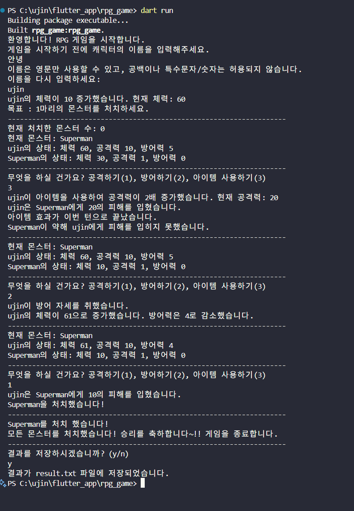

# Dart RPG Game

Dart 언어로 만든 콘솔 기반 간단 RPG 게임입니다.  
추상 클래스, 상속, 파일 입출력, 예외 처리 등을 실습합니다.

---

## 📌 프로젝트 목적

- Dart 객체지향(추상 클래스/상속) 개념 학습
- 캐릭터/몬스터 모델 설계 및 전투 로직 구현
- 파일로 데이터 입출력 실습
- 반복문, 예외 처리, Git 브랜치 운영 실습

---

## ✅ 주요 기능

| 구분 | 기능                                                                                                                                                 |
| ---- | ---------------------------------------------------------------------------------------------------------------------------------------------------- |
| 필수 | - 파일로부터 데이터 읽기<br>- 캐릭터 이름 입력받기<br>- 게임 종료 후 결과 파일 저장                                                                  |
| 도전 | - 캐릭터 체력 증가<br>- 아이템 사용 기능<br>- 몬스터 방어력 증가<br>- 나만의 기능 (경험치 및 레벨업 기능, 몬스터 처치시 랜덤 박스 획득 및 상점 기능) |

---

## ⚙️ 기술 스택

- Dart SDK
- Git / GitHub

---

## 🗂️ 실행 방법

```bash
# 저장소 클론
git clone https://github.com/treeandturtle/rpg_game.git

# 실행
dart run bin/rpg_game.dart
```

---

## 📂 폴더 구조

```plaintext
rpg_game/
 ├── bin/
 │   └── rpg_game.dart          # 실행 파일 (main)
 ├── lib/
 │   ├── abstract_model.dart    # 추상 클래스 정의
 │   ├── character_model.dart   # 캐릭터 클래스 정의
 │   ├── monster.model.dart     # 몬스터 클래스 정의
 │   └── game_model.dart        # 게임 로직 클래스
 ├── character.txt              # 캐릭터 데이터
 ├── monsters.txt               # 몬스터 데이터
 ├── result.txt                 # 게임 결과 저장 파일
 ├── pubspec.yaml
 └── README.md
```

---

## 🔍 코드 구성 & 핵심 설명

### 1️⃣ `abstract_model.dart`

- **추상 클래스 `Unit`**
  - `name` : 캐릭터/몬스터 이름
  - `health` : 체력
  - `attackPower` : 공격력
  - `defense` : 방어력
  - `attack(Unit target)` : 추상 메서드, 타겟 공격
  - `showStatus()` : 추상 메서드, 상태 표시

### 2️⃣ `character_model.dart`

- **`Character` 클래스**
  - `extends Unit` → `Unit`을 상속
  - 추가 필드: `items` (아이템 목록), `hasUsedItem` (아이템 사용 여부) , `isItemEffectActive` (공격력 적용 유무)
  - 메서드:
    - `attack()` : 몬스터 공격 구현
    - `defend()` : 방어 로직 구현
    - `choiceItem()` : 아이템 사용 시 공격력 증가
    - ` loadCharacterStats(String name)`: 캐릭터 파일 로드
    - `healthIncrease(Unit target)`: 초반 3분의 1 확률로 체력 증가
    - `levelup()`: 레벨업 및 경험치 획득 기능
    - ` radomBox()`: 몬스터 처치시 랜덤으로 골드 및 디버프 기능

### 3️⃣ `monster.model.dart`

- **`Monster` 클래스**
  - `extends Unit` → `Unit` 상속
  - 추가 필드: `turnCounter` (방어력 증가용)
  - 메서드:
    - `attack()` : 캐릭터 공격
    - `defend(Monster monster) ` : 방어력 증가 로직
    - ` loadMonsterStats()`: 몬스터 파일 로드

### 4️⃣ `game_model.dart`

- **`Game` 클래스**
  - `character` : 플레이어 캐릭터 인스턴스
  - `monsters` : 몬스터 리스트
  - `startgame()`: 게임 진행하는 메인 로직
  - `battle(Monster monster)` : 전투 1,2,3 선택 로직
  - `getRandomMonsters()` : 랜덤 몬스터 출현 로직
  - `rebattle(targetmonster)` : 실제로 반복 되는 전투 로직
  - `checkFight()` : 다음 대결을 확인하는 로직
  - `saveGameResult(Character character, bool isWin)` : 게임을 저장하는 로직
  - `market() `: 상점을 사용하는 기능

### 5️⃣ `bin/rpg_game.dart`

- 프로그램 시작점
  - `main()` 함수: `Game` 인스턴스 생성 → 데이터 로드 → 게임 실행

---

## ⚠️ 트러블슈팅 요약

- 추상 클래스 구조 설계 오류 → super 초기화/오버라이드 실습
- 무한루프 흐름 → break/continue 재정리
- FileMode.append 사용으로 결과 누적 저장
- Git test → main 병합 흐름 개선
- 코드 가독성을 위해 중복 while문을 최대한 사용을 안할려고 노력

---

## 📸 실행 스크린샷

```markdown

`이미지를 올리는 방법을 모르겠습니다 ㅠㅠ`
```

---

## 🔗 GitHub

[treeandturtle/rpg_game](https://github.com/treeandturtle/rpg_game)

## 🙌 작성자

- Ujin
- [GitHub](https://github.com/treeandturtle)
